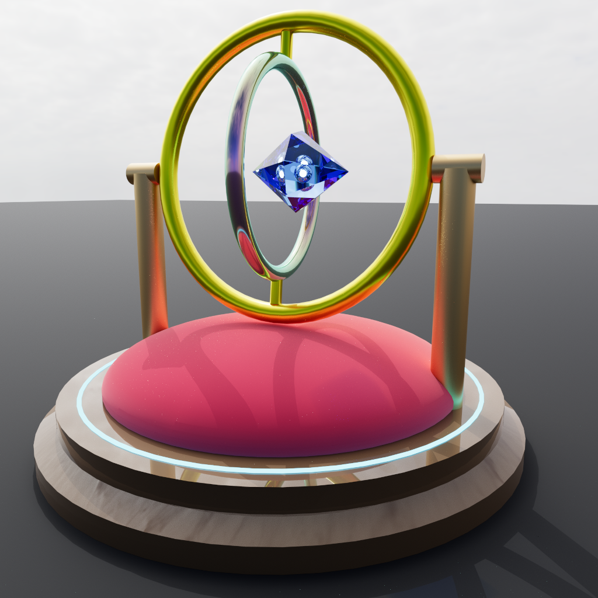

# OpenSCAD GLTF Viewer

A modern, web-based editor and 3D viewer for OpenSCAD. It natively compiles `.scad` scripts directly to **glTF/GLB** formats in the browser using WebAssembly, and renders them using a cutting-edge Three.js pipeline supporting **GPU Path Tracing**, **PBR materials**, and **Skeletal Animations**.

**🌐 Live Demo:** [openscad-gltf-viewer](https://iliagrigorevdev.github.io/openscad-gltf-viewer/)



## ✨ Features

- **100% Client-Side Compilation**: Compiles OpenSCAD scripts directly to `.glb` binaries entirely in the browser using [`openscad-gltf-wasm`](https://github.com/iliagrigorevdev/openscad-gltf-wasm). No backend server is required.
- **Photorealistic GPU Path Tracing**: Toggle on **Path Tracing** for incredibly realistic lighting, soft shadows, and physically accurate glass refractions/transmissions powered by `three-gpu-pathtracer`.
- **Extended PBR Support**: Visualize advanced material properties extending standard OpenSCAD, including `metalness`, `roughness`, `transmission` (glass), `clearcoat`, `sheen`, `ior`, `emissive`, `specular`, and `iridescence`.
- **Skeletal Animations**: Fully supports parsing and playing hierarchical bone animations defined in the custom SCAD engine.
- **Auto Smooth Geometry**: Toggle on **Auto Smooth** to automatically calculate and apply smooth vertex normals to blocky CAD geometry using a custom angle-based normal welding algorithm.
- **Drag-and-Drop Support**: Instantly load existing scripts by dragging and dropping any `.scad` file directly into the browser window.
- **AI Prompt Generator**: Because LLMs don't know about this engine's custom syntax, the viewer includes a built-in tool to generate AI-ready prompts. Describe your object, copy the prompt, and paste it into Gemini or Claude to get perfectly compatible SCAD code!
- **Instant Export & Image Capture**: Download your `.scad` source code, export the resulting standard `.glb` file (which automatically bakes in your smoothed geometry and animations), or instantly save a `.png` screenshot of your current render viewport.

## 🎮 How to Use

### 1. The AI Prompt Generator

1. Type a description of the object you want into the text area (e.g., _"A shiny gold ring with an embedded red gem"_).
2. Click **📋 Copy Prompt to Clipboard**.
3. Paste the copied text into your favorite LLM (Gemini, Claude, etc.). The copied text secretly includes all the custom syntax rules the AI needs to generate PBR materials and animations.
4. Copy the AI's generated OpenSCAD code and paste it into the editor.

### 2. The SCAD Editor

- **Load & Drag-and-Drop**: Click the **📁 Load** button to open a file dialog, or drag a `.scad` file from your computer and drop it anywhere on the app to instantly load its contents into the editor and trigger a render.
- Toggle **Auto Render** to automatically compile and update the 3D viewer when you stop typing (debounced at 800ms). Enabled by default. (Note: If the editor is empty, it will fall back to a default sample scene).
- You can manually trigger a render using the **▶ Render** button.
- Use **⬇ SCAD** or **⬇ GLTF** to download your work. _(Note: If "Auto Smooth" is enabled, the `.glb` export will preserve the computed smooth vertex normals!)_
- Use **📷 Image** to capture and download a high-quality `.png` screenshot of the 3D viewport.

### 3. Viewer Controls

- **Orbit Controls**: Left-click and drag to rotate, right-click and drag to pan, scroll to zoom.
- **Path Tracing Toggle**: Switches from the standard WebGL rasterizer to a physically-based path tracer. This is highly recommended for materials with `transmission` (glass/water) to see accurate refractions.
- **Auto Smooth Toggle**: Averages face normals based on a crease angle, instantly giving your faceted models a smooth, modern 3D look.

## 🚀 Local Development

To run this project locally, ensure you have [Node.js](https://nodejs.org/) installed:

```bash
# Install dependencies
npm install

# Start the Vite development server
npm run dev
```

## 🛠 Tech Stack

- **Framework**: Vanilla JS + [Vite](https://vitejs.dev/)
- **Core Compiler**: Custom OpenSCAD Emscripten port [`openscad-gltf-wasm`](https://github.com/iliagrigorevdev/openscad-gltf-wasm)
- **3D Engine**: [Three.js](https://threejs.org/)
- **Path Tracing**: [three-gpu-pathtracer](https://github.com/gkjohnson/three-gpu-pathtracer)

## 📄 Custom SCAD Syntax Overview

Because this viewer uses a custom fork of OpenSCAD, you can use powerful new syntax:

**PBR Materials:**

```openscad
color("white", roughness = 0.1, metalness = 1.0, clearcoat = 1.0, iridescence = 1.0, emissive = [0.2, 0.5, 1.0], emissiveIntensity = 2.0) {
    sphere(r=10);
}
```

**Skeletal Animations:**

```openscad
armature(animations = [
  ["Rotor", [[0.0, [0,0,0]], [1.0, [0,90,0]], [2.0, [0,180,0]]]]
]) {
    bone(name="Rotor") {
        cylinder(h=5, r=10);
    }
}
```

_(For full syntax, see the [openscad-gltf-wasm](https://github.com/iliagrigorevdev/openscad-gltf-wasm))._

## Assets

- **Environment Map (HDR)**: [Aristea Wreck Puresky](https://polyhaven.com/a/aristea_wreck_puresky) by **Jarod Guest** via [Poly Haven](https://polyhaven.com/). Licensed under [CC0](https://polyhaven.com/license).

## 📜 License

Please see the `LICENSE` file for details. Note that the underlying OpenSCAD engine retains its GPL-2.0 (or later) licensing.
